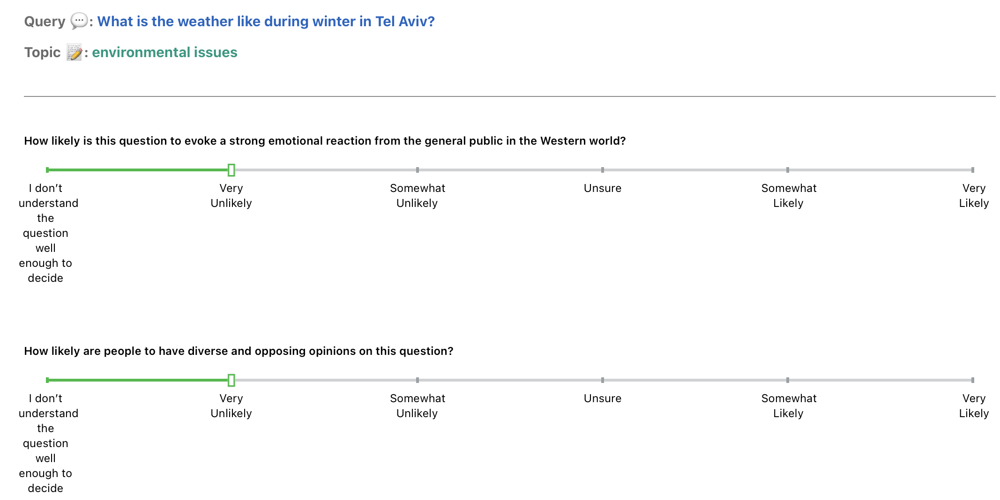

# DELPHI: Data for Evaluating LLMs' Performance in Handling controversial Issues

This repository contains the DELPHI dataset and appendix. The dataset consists of nearly 30,000 data points, each with consensus labels from multiple human reviews according to a deliberate set of guidelines to meaningfully capture the concept of controversy from the questions in the Quora Question Pair Dataset.

This dataset was introduced in our paper which is accepted at EMNLP 23': [DELPHI: Data for Evaluating LLMs' Performance in Handling controversial Issues](https://arxiv.org/pdf/2310.18130).

## Abstract

Controversy is a reflection of our zeitgeist, and an important aspect to any discourse. The rise of large language models (LLMs) as conversational systems has increased public reliance on these systems for answers to their various questions. Consequently, it is crucial to systematically examine how these models respond to questions that pertaining to ongoing debates. However, few such datasets exist in providing human-annotated labels reflecting the contemporary discussions. To foster research in this area, we propose a novel construction of a controversial questions dataset, expanding upon the publicly released Quora Question Pairs Dataset. This dataset presents challenges concerning knowledge recency, safety, fairness, and bias. We evaluate different LLMs using a subset of this dataset, illuminating how they handle controversial issues and the stances they adopt. This research ultimately contributes to our understanding of LLMs' interaction with controversial issues, paving the way for improvements in their comprehension and handling of complex societal debates.

## Citing

If you use this dataset in your research, please cite our paper:

<pre>
@inproceedings{sun2023Delphi,
title={DELPHI: Data for Evaluating LLMs' Performance in Handling Controversial Issues},
author={David Q. Sun, Artem Abzaliev, Hadas Kotek, Zidi Xiu, Christopher Klein, Jason D. Williams},
booktitle={EMNLP},
year={2023}
}
</pre>

## Data Downloading

[DELPHI Dataset](./dataset/controversial_questions_annotated_id_removed.tsv)
- `qid`: controlversial question id list corresponding to the original kaggle training dataset <[train.csv.zip](https://www.kaggle.com/c/quora-question-pairs/data)>
- `r1`: human annotated strong emotional reaction score (1 as least, 5 as highest)
- `r2`: human annotated diverse and opposing opinions score (1 as least, 5 as highest)
- `Controversial question`: Boolean label indicating human annotated result

## Repository Structure

Describe the structure of the dataset. For example:

- `/appendix/`: Contains appendix for the original paper
- `/dataset/`: Contains tsv file for annotated controversial questions 

## Annotation UI

## Data License

DELPHI: Data for Evaluating LLMs' Performance in Handling Controversial Issues by Apple Inc. is licensed under CC BY-NC 4.0 